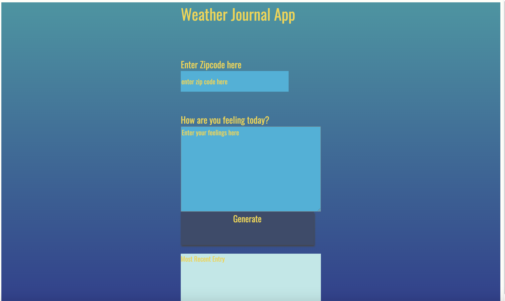
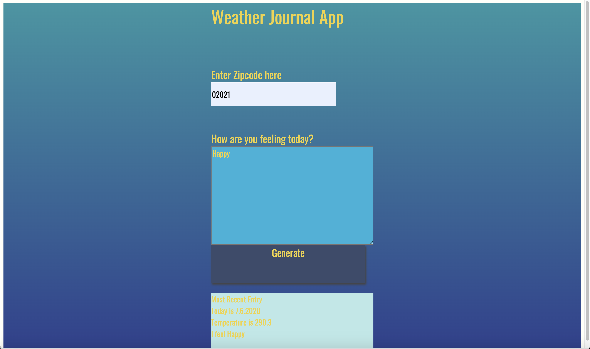

# Weather-Journal App Project

## Overview
This project requires you to create an asynchronous web app that uses Web API and user data to dynamically update the UI. 

## Instructions
This will require modifying the `server.js` file and the `website/app.js` file. You can see `index.html` for element references, and once you are finished with the project steps, you can use `style.css` to style your application to customized perfection.

## Extras
If you are interested in testing your code as you go, you can use `tests.js` as a template for writing and running some basic tests for your code.

## Port Number
For this study exercise I pick 3080 as port number

Detail Reference from IANA
Service names and port numbers are used to distinguish between different
services that run over transport protocols such as TCP, UDP, DCCP, and
SCTP.

Service names are assigned on a first-come, first-served process, as
documented in [RFC6335].

Port numbers are assigned in various ways, based on three ranges: System
Ports (0-1023), User Ports (1024-49151), and the Dynamic and/or Private
Ports (49152-65535);

## Run this application
- Pre-requisite : Install node.js

- unzip the projects folder.

- install the dependencies

```
npm install

```

- Run the server.
```
npm start
```
- View the URL http://localhost:3080/ in browser

## Project Screenshots
### App Home page

### App Data Return page

